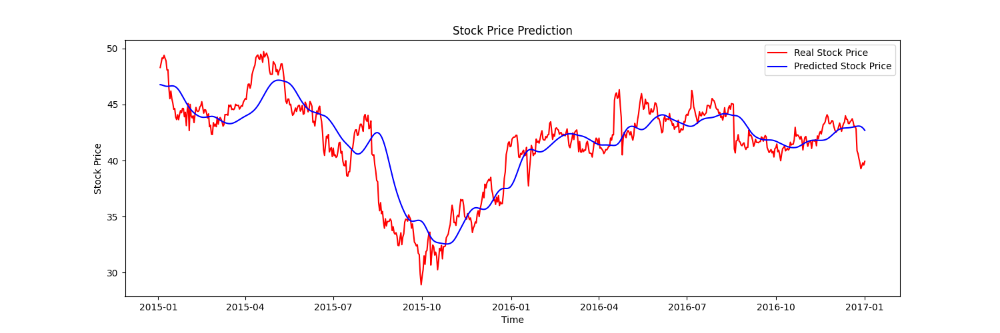
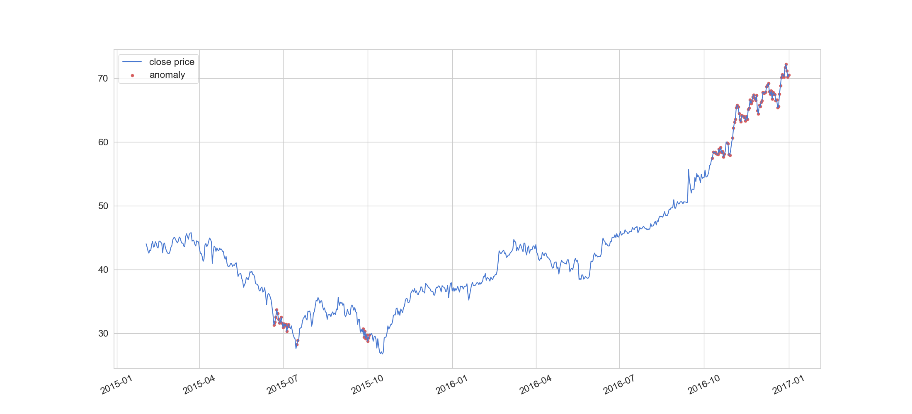
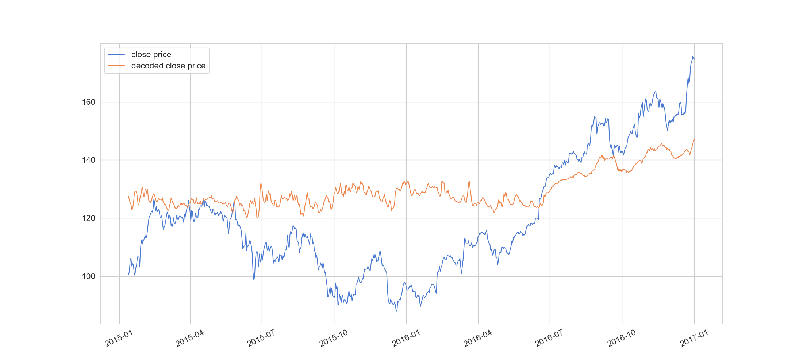

# Project 3

## Instructions

Forecast: `python forecast.py -d <dataset> -n <number of time series used>`

Detect: `python detect.py -d <dataset> -n <number of time series used> (-m <max absolute error>)`

Reduce: `python reduce.py -d <dataset> -q <queryset> -D <output_dataset> -Q <output_queryset>`

## Examples

Forecast: `python forecast.py -d data/nasdaq2007_17.csv -n 10`

Detect: `python detect.py -d data/nasdaq2007_17.csv -n 10 -m 0.65`

Reduce: `python reduce.py -d data/nasd_input.csv -q data/nasd_query.csv -D dataset_output.csv -Q queryset_output.csv`

## Project Structure

- **.**: python source files
- **data**: input files
- **media**: images

## Report

### A)

The sequential model uses 9 layers including the output layer, with 0.2 dropout regularisation layers between
the LSTM layers to avoid overfitting.
The optimizer used is adam and loss is calculated with mean_squared_error.

The output layer has 1 node while the previous ones have 50 nodes.

For our dataset the best compromise between accuracy and performance came with 10 epochs and 1024 batch size.

The predicted stock prices are in most cases very close to the actual stock prices and follow the same
changes with a small delay.

### B)

The sequential model used for anomaly detection uses 6 layers:
LSTM(64 nodes) -> Dropout(0.2) -> RepeatVector -> LSTM(64 nodes) -> Dropout(0.2) -> TimeDistributed

It also uses the adam optimizer and max absolute error as a loss function.

80% of the data is used for training and the model is fitted with 10 epochs and 32 batch size.

The model correctly predicts most changes of the closing stock price.

### C)

The input time series are decoded into a lossy version reproduced from their
reduced form. In many cases the produced time series is quite different from
the original time series, but in some cases the results are very close.

For best results, we used 15 epochs and 2048 batch size,
binary crossentropy as a loss function and the standard scaler
for normalization.
